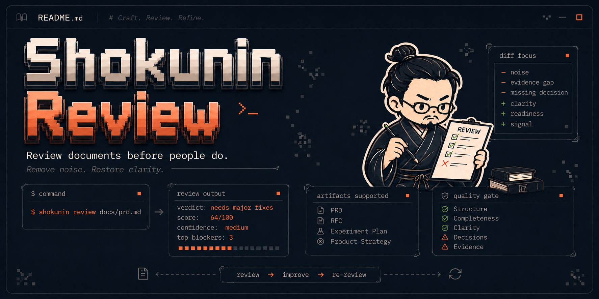

<p align="center">
  
</p>

<h1 align="center">Shokunin Review</h1>

<p align="center">
  <strong>Review documents before people do.</strong>
</p>

<p align="center">
  Terminal-first review skill and validation harness for PRDs, RFCs, Experiment Plans, and Product Strategy docs.
</p>

<p align="center">
  <a href="#quick-start">Quick Start</a> •
  <a href="#example-output">Example Output</a> •
  <a href="#what-it-does">What It Does</a> •
  <a href="#mvp-1-scope">MVP 1 Scope</a> •
  <a href="#security">Security</a> •
  <a href="#roadmap">Roadmap</a>
</p>

<p align="center">
  
  
  
  
</p>

---

## Why this exists

AI can generate polished product and technical documents in seconds.

But polished is not the same as review-ready.

Many documents still miss:
- clear decisions
- evidence
- baseline metrics
- testable requirements
- technical feasibility
- experiment decision rules
- real trade-offs

Shokunin Review catches those gaps before the document reaches a human reviewer.

---

## What it does

<table>
<tr>
<td width="25%"><strong>Scores readiness</strong><br/>0–100 score with confidence and score caps.</td>
<td width="25%"><strong>Finds blockers</strong><br/>Missing decisions, evidence gaps, vague metrics, weak requirements.</td>
<td width="25%"><strong>Suggests fixes</strong><br/>Concrete next actions, not generic criticism.</td>
<td width="25%"><strong>Protects review time</strong><br/>Stops low-readiness docs before human review.</td>
</tr>
</table>

---

## Quick Start

```bash
git clone https://github.com/vstakhovsky/shokunin-review.git
cd shokunin-review
./bin/install
shokunin review examples/prd/weak-ai-food-agent.before.md
```

You will get:
- readiness score
- top blockers
- score caps
- recommended next action
- optional improvement loop

---

## Example Output

```text
🔴 Not review-ready — 36/100
Confidence: Medium

This PRD describes an attractive AI idea, but not a decision-ready MVP.

Top blockers:
1. [evidence-gap] Problem is not quantified.
2. [missing-decision] MVP scope is not defined.
3. [overclaim] Business impact is claimed without baseline or causal logic.

Score caps applied:
- No evidence → max score 60
- No MVP scope → max score 55
- No primary metric → max score 55

Recommended next action:
Narrow it into a decision-ready MVP proposal.
```

---

## Before / Review / After

### Before

```text
We will build an AI Food Delivery Agent to increase sales,
improve retention, personalize user experience, and make ordering easier.
```

### Shokunin Review

```text
🔴 Not review-ready — 36/100

Top blockers:
1. [evidence-gap] Problem is not quantified.
2. [missing-decision] MVP scope is not defined.
3. [overclaim] Business impact is claimed without baseline.
```

### After

```text
Decision: test an AI reorder assistant for returning users
who ordered 3+ times in 60 days.

Primary metric: reorder conversion.
Guardrails: cancellation rate, support contacts, latency.
```

---

## Supported artifacts

| Artifact | MVP 1 status | Main review focus |
|---|---|---|
| PRD | Supported | Problem, user, evidence, requirements, metrics, decision ask |
| RFC / Technical Design | Supported | Architecture, trade-offs, dependencies, failure modes, rollout |
| Experiment Plan | Supported | Hypothesis, metrics, guardrails, sample assumptions, decision rule |
| Product Strategy | Supported | Segment, pain, opportunity, trade-offs, sequencing, business logic |

---

## Document types

| Document | Main question | Primary layer | Main risk |
|---|---|---|---|
| PRD | What should we build and why? | Product / business | Building the wrong thing |
| RFC | How should we build it? | Technical design | Building it wrong |
| Experiment Plan | How will we test and decide? | Product / data | Learning nothing or misreading results |
| Product Strategy | What strategic choice should we make? | Product / business strategy | Choosing a vague direction without evidence |

---

## Commands

```bash
shokunin review <file>              # Review a document
shokunin improve <file>             # Suggest improvements
shokunin rerun <file> --compare <original-file>  # Re-review and compare
shokunin score <file>               # Show readiness score breakdown
shokunin eval                       # Run eval harness
```

### Output modes

```bash
--mode default    # Short, terminal-friendly output
--mode full        # All findings, detailed breakdown
--mode json        # Structured JSON for automation
--mode markdown    # Human-readable report
--mode quiet       # Minimal output
```

### Claude Code commands

```text
/shokunin-review              # Generic review
/shokunin-review-prd          # PRD review
/shokunin-review-rfc          # RFC review
/shokunin-review-experiment   # Experiment Plan review
/shokunin-review-strategy     # Product Strategy review
/shokunin-improve              # Suggest improvements
/shokunin-rerun                # Re-review
/shokunin-score               # Explain readiness score
```

---

## Readiness Score

Readiness Score is a 0–100 signal indicating whether a document is ready for human review.

**Score bands:**

| Score | Band | Meaning |
|-------|------|---------|
| 90–100 | 🟢 Review-ready | Ready for human review |
| 75–89 | 🟡 Ready with minor fixes | Minor improvements needed |
| 60–74 | 🟠 Needs major fixes | Significant improvements needed |
| 40–59 | 🔴 Needs revision | Major revisions needed |
| 0–39 | 🔴 Not review-ready | Not ready for review |

**Score caps** prevent polished but incomplete documents from scoring high:
- No evidence → max score 60
- No primary metric → max score 55
- No MVP scope → max score 55
- No AI guardrails for AI feature → max score 70

---

## What Shokunin catches

- **Missing decisions** — What are we actually deciding?
- **Evidence gaps** — Claims without supporting data
- **Metric fog** — Success metrics that are unclear or missing
- **Requirement fog** — Requirements that aren't testable or verifiable
- **Technical handwaving** — "We'll figure it out later" architecture
- **AI guardrail gaps** — AI features without safety boundaries
- **Strategy fog** — Vague strategic language without clear choices
- **Opportunity fog** — Market sizing without business logic
- **Simpler alternative gaps** — AI proposals when non-AI solutions would suffice
- **Cost/ROI gaps** — Financial claims without unit economics or baseline

---

## MVP 1 Scope

MVP 1 supports **four artifact types**:

1. **PRD** — Product Requirements documents
2. **RFC** — Technical Design documents
3. **Experiment Plan** — Pre-A/B-test decision documents
4. **Product Strategy** — Strategic choice documents

### Supported formats

- Markdown files: `.md`
- Plain text files: `.txt`
- Text extracted from docs: `.docx` / Google Docs export (best-effort)
- Text extracted from PDFs: `.pdf` (best-effort)
- Text extracted from presentations: `.pptx` (best-effort)

<details>
<summary><strong>Not supported in MVP 1</strong></summary>

MVP 1 does **not** support:

- Image-only diagrams
- Visual architecture diagram reasoning
- Screenshots
- Video
- Spreadsheet model validation
- Board decks as visual presentations
- Full market research validation
- Legal/compliance certification
- Automatic full document rewrite by default
- Web UI
- Domain packs
- Production data verification
- Persistent memory
- MCP server
- Market research agents
- Board / CEO / CPO simulation

</details>

---

## Security

**Do not paste confidential, NDA-protected, personal, customer, financial, security, or production secrets into Shokunin Review unless you understand your local setup and data handling.**

For sensitive documents:

```bash
shokunin review file.md --local-only --no-trace
```

### Security principles

- Do not store raw document text by default
- Do not write sensitive input into traces by default
- Warn before reviewing documents that may contain secrets
- Support `--no-trace` and `--local-only`
- Never invent company metrics, customer data, research, or strategy
- Never accuse the author of using AI

---

## Documentation map

| Area | Link |
|---|---|
| MVP scope | docs/mvp-scope.md |
| Design system | DESIGN.md |
| Functional requirements | FUNCTIONAL_REQUIREMENTS.md |
| Non-functional requirements | NON_FUNCTIONAL_REQUIREMENTS.md |
| Roadmap | ROADMAP.md |
| Security | SECURITY.md |
| Limitations | docs/limitations.md |
| Anti-overengineering | docs/anti-overengineering.md |

---

## FAQ

### What is Shokunin Review?

Shokunin Review is a terminal-first review skill and validation harness for AI-assisted work artifacts. It reviews PRDs, RFCs, Experiment Plans, and Product Strategy documents before stakeholder review.

### Is Shokunin Review an AI detector?

No. Shokunin Review does not try to prove whether a document was written by AI. It checks whether the document is ready for serious human review.

### What problem does it solve?

AI tools can generate polished documents quickly, but many of those documents are not review-ready. They may have structure without decisions, impact claims without evidence, vague requirements, weak metrics, or technical handwaving.

### Who is it for?

Product Managers, Technical Product Managers, Engineering Managers, Tech Leads, Data / ML teams, founders, and AI-assisted builders using Claude Code, Cursor, Codex, Gemini, or similar tools.

### Does Shokunin Review rewrite my document?

Not by default. The default behavior is review-first: score, blockers, and smallest useful improvement. Full rewrites are intentionally avoided unless the user asks for them.

---

## Roadmap

See `ROADMAP.md` for detailed roadmap.

### MVP 1
Text-based review readiness for PRD, RFC, Experiment Plan, Product Strategy

### MVP 2
Richer section-level patch suggestions, interactive Q&A mode, GitHub PR export

### MVP 3
ADR, Executive memo, Architecture notes, ML/DS docs, Presentation text

### MVP 4
Mermaid/PlantUML review, PDF/PPTX extraction, Image-based diagram review

### MVP 5
Domain packs for AI products, fintech/risk, marketplaces, internal platforms

---

## Contributing

See `CONTRIBUTING.md` for contribution guidelines.

```bash
# Fork and clone
git clone https://github.com/your-username/shokunin-review.git
cd shokunin-review

# Install and test
./bin/install
./bin/run-evals
```

---

## License

MIT License — see `LICENSE` file for details.

---

## Philosophy

**Shokunin** means craftsperson.

In this project, Shokunin represents disciplined review, clarity, and respect for human reviewer time.

```text
If the reviewer has to find the problem, define the decision, 
invent the metric, and rewrite the requirement, 
the artifact is not ready.
```

```text
Shokunin Review does not generate more documentation.
It reduces uncertainty until the document becomes decision-ready.
```

---

**Remove noise. Restore clarity.**
